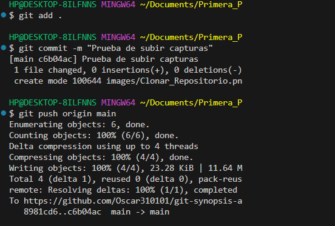
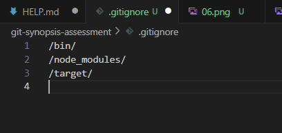
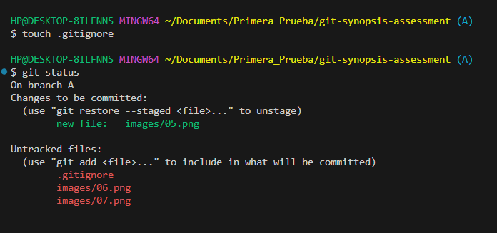

# Solución

## PASO A PASO EL PROCEDIMIENTO

## Actividad 1

1. Primero clone el repositorio, seguidamente navegue al directorio "git-synospsis-assessment" hice algunas pruebas para que las imagenes se puedan adjuntar claramente en el fichero "HELP.md", todo esto en mi copia que hice con el fork, acontinuación, presento procedimiento:

    
    

Luego, iniciamos con la actividad 1 : 
Para crear una nueva rama debemos estar asegurarnos de estar en la rama principal y que este actualizada:
    

Seguidamente, creamos la nueva rama llamada "A"  y verificamos la creación y que estamos usando esta nueva rama:
    

Pot último, cree los ficheros "script.js", "styles.css" y el "index.html":
    

2. Primeramente, para poder restringir del historial de cambios a carpetas especificas, debems necesitar un archivo adicional ".gitignore". Debemos crear este fichero y luego dentro escribir lo que queresmos ignorar, a continuación:

    
    

para comprobar si toma en cuenta estos archivos hacemos un "git status" si existe algun archivo con esa ruta. Segun la documentación, si no se ve en el indice de Git, es buena practica y para inconvenientes futuros, borrar el indice de Git con : 

   
   

3. Para poder crear las carpetas utilizamos "mkdir" y revisando documentación, se nos indica que Git no rastrea carpetas vacias por defecto, por esta razón existe un sencilla técnica que es crear carpetas de tipo  ".gitkeep" dentro de las carpetas vacias. De esta manera puedan ser tomadas en cuenta, a continuación: 
    

    ...
